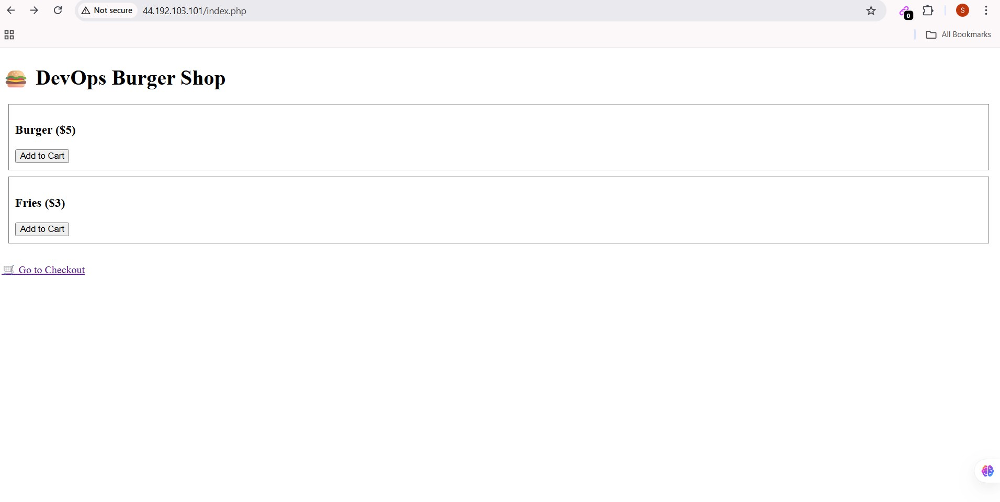
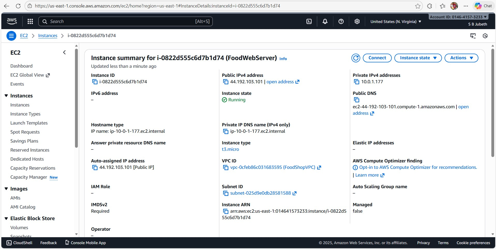
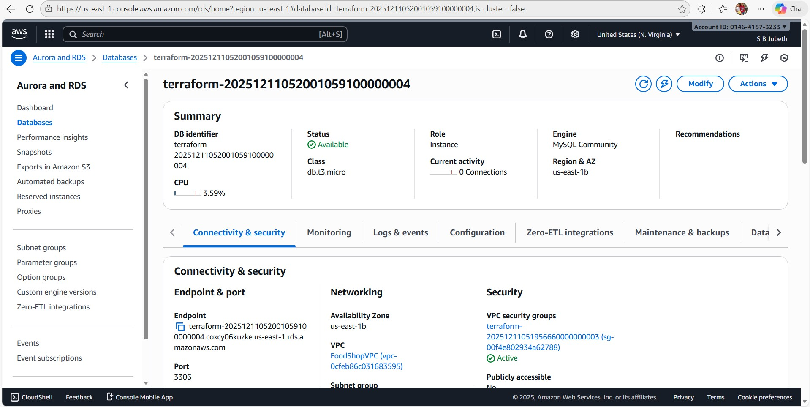

# 🍔 AWS Cloud E-Commerce Application

A dynamic, 2-tier e-commerce web application deployed on the AWS Cloud. This project demonstrates a fully functional "Order to Database" workflow, featuring a PHP frontend hosted on a public Web Server and a secure MySQL backend hosted in a private Database subnet.

## 🚀 Project Overview
This application simulates a real-world online food ordering system. It solves the core business need of **State Management** (Shopping Cart) and **Data Persistence** (Order History) in a cloud environment.

**Key Features:**
* **Dynamic Frontend:** PHP-based storefront allowing users to add items to a session-based cart.
* **Data Persistence:** Orders are transactionally saved to an AWS RDS MySQL database.
* **High Availability Architecture:** Designed with separation of concerns (Web Tier vs. Database Tier).
* **Security:** Database is isolated in a private environment, accessible only via the Web Server.

## 🛠️ Tech Stack
* **Cloud Provider:** Amazon Web Services (AWS)
* **Compute:** Amazon EC2 (Ubuntu Linux/Apache Web Server)
* **Database:** Amazon RDS (MySQL Engine)
* **Language:** PHP 8.1
* **Version Control:** Git & GitHub

---

## 📸 Project Screenshots

### 1. The Live Application
*A fully functional frontend connecting to the backend database. The "Order Sent" message confirms the successful write operation to AWS RDS.*


### 2. The Compute Tier (EC2)
*The Web Server hosted in the Public Subnet, handling incoming HTTP traffic.*


### 3. The Database Tier (RDS)
*The MySQL Database Instance acting as the persistent storage layer.*


---

## ⚙️ Architecture & Workflow

1.  **User Request:** The client accesses the website via the Public IP of the EC2 instance.
2.  **Session Handling:** PHP starts a session to store "Cart" items temporarily in the server's memory.
3.  **Transaction:** When "Place Order" is clicked, the Web Server opens a secure connection (Port 3306) to the RDS Endpoint.
4.  **Storage:** The order details are written to the `orders` table in the MySQL database.

## 💻 How to Run (Local or Cloud)
1.  Clone the repository.
    ```bash
    git clone [https://github.com/JubethSB/my-shop-project.git](https://github.com/JubethSB/my-shop-project.git)
    ```
2.  Configure `db_connect.php` with your MySQL credentials (or AWS RDS Endpoint).
3.  Run `install.php` once to initialize the database tables.
4.  Launch `index.php` to start ordering!

---
*Created by Jubeth S B*